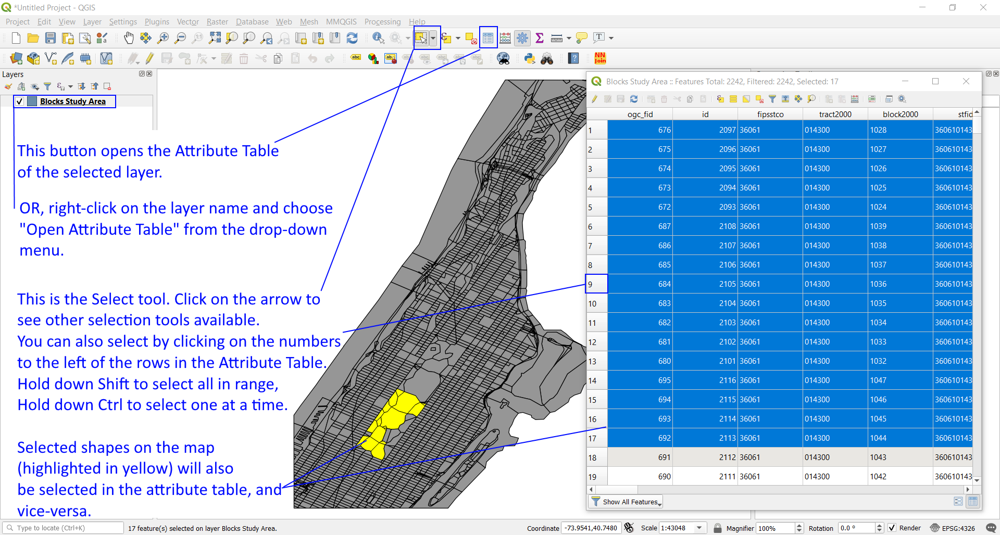

[<<< Previous](4layerpr.md)  | [Next >>>](6layer2.md)  

# The Attribute Table

Right-clicking on the layer name in the `Layers` Panel will open up a menu with several options. Let’s look at the one called `Open Attribute Table`. When you do, you will see a spreadsheet-like list of every feature in that layer. Remember, every row is a single feature in the layer, and if you put the attribute table and the map side-by-side, you’ll see that every time you select a row, a specific area of the map will be highlighted. You can also select several rows at a time and the according features will all be highlighted in the map. The opposite is true as well: if you select a feature in the map using the `Select Features` button on the top menu, the same feature(s) will be selected when you open the attribute table. Note that you may have a different selection in each layer, and if you are not careful, these might affect the operations you do with your data. The `Deselect All` button will be useful to deselect everything in every layer.

You may notice that, unlike in an Excel spreadsheet, you can't edit the contents of the attributes table. This is because QGIS opens Layers in read-mode only, to avoid accidental edition of the data. Later in this guide we will learn how to toggle `Edit mode` on to make modifications to the table, such as editing an attribute value or adding a new field.

[<<< Previous](4layerpr.md)  | [Next >>>](6layer2.md)  
