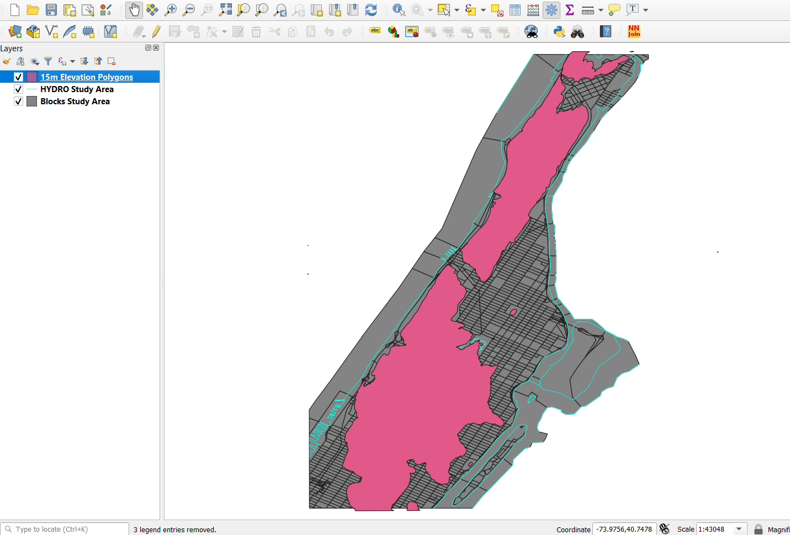

[<<< Previous](5attrib.md)  | [Next >>>](7editing.md)  

# Adding a Second and Third Vector Layer & Harmonizing CRS

Now that we have customized our layer and seen the attribute table, let’s go ahead and open a second layer:

* Click on the `Add Vector Layer` button.
* Navigate to the HYDRO folder, and click on "HYDRO Study Area.sqlite".
* You might get an error, or a warning. This is because the CRS was not defined for this file.
* If the `Coordinate Reference System Selector` is prompted, select EPSG:4269 as the appropriate CRS.

The reason you want to choose EPSG:4269 is because, if you recall, the Blocks layer is projected in that CRS. You want all layers to be in the same CRS because otherwise any geoprocessing operations you do involving two layers could have wrong results.  

Even if you were not prompted to choose the CRS, you will see that the layer seems to be shown properly on the map (a line contouring the blocks). This might be due to the On-The-Fly option of QGIS, which automatically "translates" all layers into a single "project CRS" so that they can be visualized together.  

Now, let's add the third layer:  

* Click on the `Add Vector Layer button`.
* Navigate to the ELEVATION folder, and click on "15m Elevation Polygons.sqlite".  
* Click on `Add` to close the window.

Congratulations, now you have three layers on QGIS. Feel free to explore the new layers' attribute tables, properties, change the colors. Sometimes, layers you use have weird names (numbers, codes, etc.). If this were the case, I recommend that you rename layers to something more practical, like “Blocks” and “Hydro”. This is a good idea so that you can always easily locate the main layers, as the operations that we will do will multiply the number of layers and you do not want to get lost in your data. To rename a layer:

* Right-click on its name in the layers panel.
* Select the last option in the menu, `rename`. 

You can also toggle the visibility of layers on/off by clicking on the checkbox to the left of the layer’s name. Also remember that you can make a layer transparent in the `Style` tab of the `Properties` dialog box. Further, you can drag and drop layers in your preferred order, knowing that the most visible layer (the one on top) will always be the first one. Knowing these features will be useful when too many layers are open and you want to focus on a specific group or one in particular.

[<<< Previous](5attrib.md)  | [Next >>>](7editing.md)  
